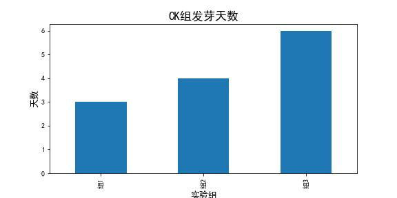
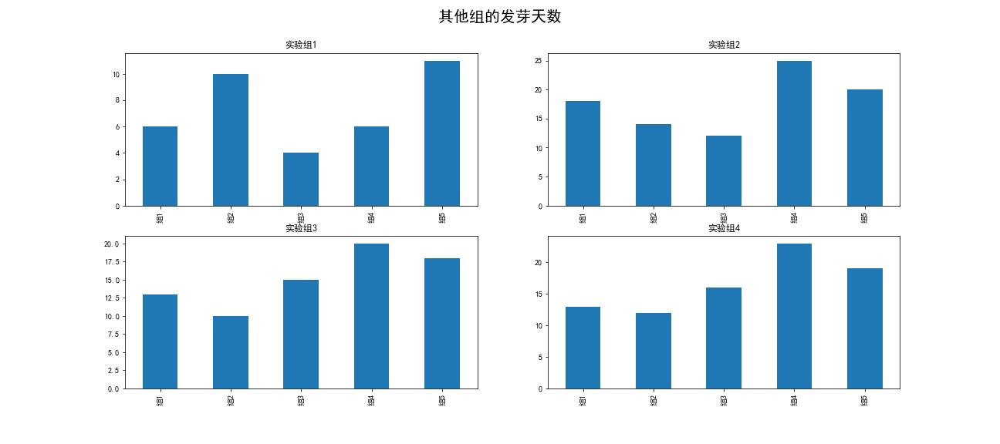
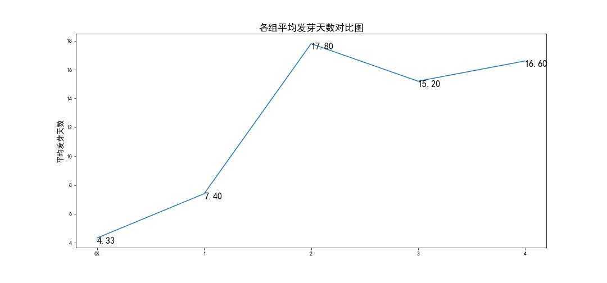

# 重金属镉污染下石榴的耐性特征及富集 数据分析

## 数据准备
选取了部分毕业论文数据，用python的pandas和matplotlib对数据进行了重新分析。
分析五组实验石榴发芽天数，研究重金属镉对植被耐性特征的影响，

## 环境设置
```
import pandas as pd
import matplotlib.pyplot as plt

plt.rcParams['font.sans-serif']=['SimHei'] #用来正常显示中文标签
plt.rcParams['axes.unicode_minus'] = False #用来正常显示负号
```

## 读取数据
```Python
发芽天数 = pd.read_csv('发芽天数.csv')
```

## 耐性特征
### 查看空白对照组的发芽天数
```
#提取需要的数据
发芽天数.set_index("cd浓度",inplace = True)
发芽_对照组 = 发芽天数.iloc[0]
发芽_对照组 = 发芽_对照组[:3]

#绘制图片
plt.figure(figsize=(8,4))
发芽_对照组.plot(kind="bar")
plt.xlabel("实验组", size = 13)
plt.ylabel("天数", size = 13)
plt.title('CK组发芽天数', size = 17)
```


### 其他组的发芽天数
```
#提取需要的数据
实验组1 = 发芽天数.iloc[1]
实验组2 = 发芽天数.iloc[2]
实验组3 = 发芽天数.iloc[3]
实验组4 = 发芽天数.iloc[4]

#绘制图片
figure, axis = plt.subplots(2, 2)
实验组1.plot(kind="bar", ax = axis[0,0], figsize = (18, 8), title = '实验组1')
实验组2.plot(kind="bar", ax = axis[0,1], title = '实验组2')
实验组3.plot(kind="bar", ax = axis[1,0], title = '实验组3')
实验组4.plot(kind="bar", ax = axis[1,1], title = '实验组4')

plt.suptitle(' 其他组的发芽天数 ', fontsize=20)
```


### 各组平均发芽天数对比图
```
#求取每组发芽天数平均数
发芽天数['mean'] = 发芽天数.mean(axis=1)

a = 发芽天数.index
b = 发芽天数['mean'].tolist()

# 画折线图
plt.figure(figsize=(15,7))
plt.plot(a,b)
plt.ylabel("平均发芽天数", size = 13)
plt.title('各组平均发芽天数对比图', size = 17)

# 添加数据标签
# zip joins x and y coordinates in pairs
for x,y in zip(a,b):

    label = "{:.2f}".format(y)

    plt.annotate(label, # this is the text
                 (x,y), # these are the coordinates to position the label
                 textcoords="offset points", # how to position the text
                 xytext=(0,-10), # distance from text to points (x,y)
                 fontsize=16,
                 ha='left') # horizontal alignment can be left, right or center
```

